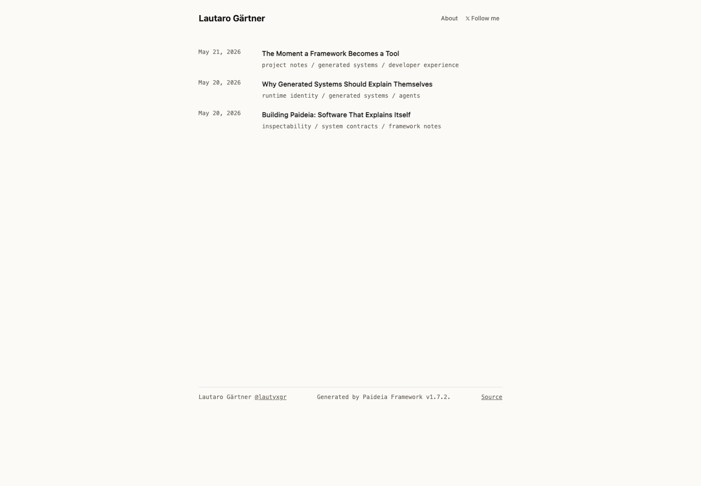
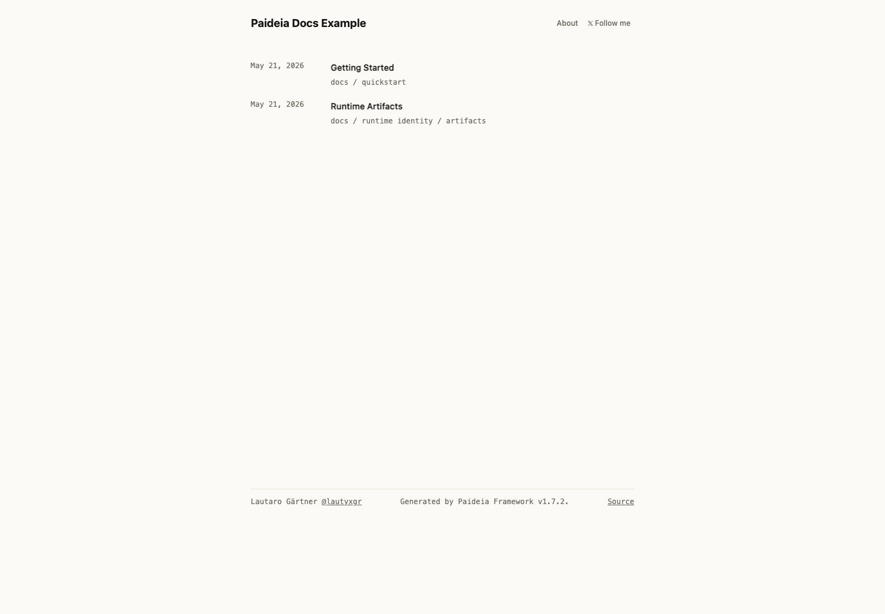

# Paideia Framework

Generated websites and applications that explain what was built.

Paideia generates small websites and applications with files that describe their routes, artifacts, capabilities, diagnostics, and runtime identity.

Current version: `v1.8.0`
Runtime identity foundation

---

## Quickstart

Create a runnable Paideia site from the framework checkout:

```bash
git clone https://github.com/LautaroGartner/paideia-framework.git
cd paideia-framework
npm install
node cli.mjs init my-site
cd my-site
npm install
npm run build
npm run start
```

Then open:

```txt
http://localhost:3000
```

Create a new post:

```bash
npm run new:post -- "My First Post"
npm run build
npm run inspect
npm run doctor
```

## What gets generated

Paideia writes normal website files plus a small set of explanation files:

```txt
dist/
  index.html
  about/index.html
  <post>/index.html
  404.html
  favicon.svg
  runtime.json
  system.json
  context.json
  llms.txt
```

## Visual tour

Generated homepage:



Docs example:



Runtime inspect:

```txt
Paideia Runtime Inspect
──────────────────────

Project
  Framework      Paideia Framework
  Version        1.8.0
  Title          Lautaro Gärtner's blog

Runtime
  Build ID       dc17859
  Mode           production
  Manifest       normalized
  Diagnostics    passing

Routes
  /                                             page   Lautaro Gärtner's blog
  /about                                        page   About
  /framework-becomes-a-tool                     post   The Moment a Framework Becomes a Tool

Artifacts
  index.html                                    page             10.2 KB
  runtime.json                                  runtime-identity 1.7 KB
  system.json                                   contract         4.3 KB
  context.json                                  agent-context    2.9 KB
  llms.txt                                      agent-guide      1.6 KB

Diagnostics
  Manifest       normalized
  Status         passing
```

Runtime doctor:

```txt
[paideia] running doctor

✓ dist/ exists
✓ dist/index.html exists
✓ dist/system.json exists
✓ dist/runtime.json exists
✓ dist/context.json exists
✓ dist/system.json contract valid
✓ dist/runtime.json valid

[paideia] doctor summary
✓ passed: 14
✗ failed: 0
• skipped: 0

[paideia] doctor passed
```

---

## What Paideia Generates

Paideia generates small inspectable websites and applications.

The generated output includes files that help humans and agents understand:
- routes
- capabilities
- generated outputs
- runtime identity
- site structure

without reverse engineering the application.

---

## What Paideia Is

Paideia is an experimental framework for building:

* small inspectable websites
* structured writing systems
* agent-readable applications
* explicit runtime contracts
* token-friendly software

Paideia generates both:

* human-facing pages
* machine-readable runtime context

The goal is not abstraction for its own sake.

The goal is software that can explain itself.

---

## Current Capabilities

`v1.8.0` can currently generate, inspect, and serve:

* static pages
* structured writing collections
* individual post pages
* generated navigation
* `404.html`
* `favicon.svg`
* `system.json`
* `runtime.json`
* `context.json`
* `llms.txt`
* deterministic build identity
* generated artifact inventory
* runtime capability declarations
* runtime diagnostics
* manifest contract validation and normalization
* writing validation
* project scaffolding with `paideia init`
* runtime inspection CLI
* post creation CLI workflow
* manifest, schema, and Markdown explanation CLI output

Paideia now powers its own website runtime.

---

## Philosophy

Paideia is built around a few constraints:

* explicit contracts over hidden magic
* inspectable generated output
* small operational surfaces
* minimal dependencies
* AI-native, not AI-chaotic
* software understandable by humans and agents
* structure where mistakes are expensive
* flexibility where creativity matters

---

# Human + Agent Readability

Paideia applications expose structured runtime context.

Generated outputs currently include:

```txt
dist/
  index.html
  about/index.html
  <post>/index.html
  404.html
  favicon.svg
  system.json
  runtime.json
  context.json
  llms.txt
```

## `system.json`

Machine-readable runtime contract.

## `runtime.json`

Runtime identity, build metadata, and generated artifact inventory.

Includes:

* framework metadata
* deterministic build fingerprint
* generated artifact paths, kinds, and byte sizes
* runtime capability declarations
* site and writing counts
* normalized manifest status
* agent-readable runtime flags

## Runtime Capabilities

Generated systems declare what they can do:

```txt
site.static
writing.posts
runtime.inspect
runtime.identity
runtime.artifactInventory
manifest.validate
manifest.normalize
diagnostics.manifest
diagnostics.writing
agent.context
agent.guide
```

Capabilities are emitted in both `system.json` and `runtime.json`.
`paideia doctor` validates that the declarations are present, unique, and complete.

## `context.json`

Compressed runtime/site summary for agents.

Includes:

* site map
* writing summaries
* latest posts
* token-friendly metadata

## `llms.txt`

Human + agent guidance entrypoint.

---

# Website Runtime

The current runtime generates a minimal static website from explicit contracts.

Example:

```ts
export const site = defineSite({
  title: "Lautaro Gärtner",
  description: "Building Paideia Framework in public.",
  pages: [
    {
      path: "/",
      title: "Home",
      body: "Building Paideia Framework in public.",
    },
    {
      path: "/about",
      title: "About",
      body: "About Paideia and this site.",
    },
  ],
});
```

Writing is also contract-based:

```ts
export const post = {
  slug: "building-paideia",
  title: "Building Paideia",
  description: "Why I started building Paideia.",
  publishedAt: "2026-05-20",
  body: `
Paideia began as an experiment around inspectable runtimes,
minimal software systems, and explicit contracts.
`,
  tokenSummary:
    "Introduction post explaining the motivation behind Paideia Framework.",
};
```

---

# CLI

Current CLI surface:

```bash
paideia dev
paideia init <project-name>
paideia build
paideia start
paideia doctor
paideia inspect
paideia new post "Post title"
paideia manifest
paideia schema
paideia explain
paideia --version
paideia --help
```

## Commands

### `paideia dev`

Starts the development runtime for a Paideia project checkout.

### `paideia init`

Creates a new Paideia project:

```bash
paideia init my-site
```

The generated project includes site and writing contracts, local scripts for build/start/doctor/inspect/new posts, and a starter README.

### `paideia build`

Generates website artifacts into `dist/` and prints a structured build summary.

### `paideia start`

Starts the production runtime.

Default port:

```txt
3000
```

Custom port:

```bash
PAIDEIA_PORT=4000 paideia start
```

### `paideia doctor`

Validates generated runtime artifacts and runtime state.
Reports manifest contract failures with diagnostic codes, paths, and messages.

### `paideia inspect`

Prints the generated runtime identity summary, build ID, artifact kinds, capabilities, manifest status, and diagnostic status.

### `paideia new post`

Creates a new writing contract:

```bash
paideia new post "My Post"
```

Generates:

```txt
src/writing/my-post.ts
```

### `paideia manifest`

Validates and prints the generated `dist/system.json` manifest.

### `paideia schema`

Prints the generated `dist/schema.sql` file when the project produces one.

### `paideia explain`

Validates the generated manifest and prints a Markdown explanation of the generated system.

---

# Production Runtime

The runtime intentionally stays small and operationally explicit.

Current production behavior:

* deterministic static serving from `dist/`
* generated 404 handling
* graceful shutdown
* hardened path resolution
* explicit MIME handling
* method restrictions
* structured runtime logs
* health endpoint
* minimal trusted surface

Production excludes development tooling.

---

# Health Endpoint

Production exposes one operational endpoint:

```txt
GET /__paideia/health
```

Example:

```json
{
  "status": "ok",
  "framework": "paideia",
  "version": "1.8.0",
  "runtime": "production",
  "dist": "ready"
}
```

---

# Diagnostics

Run diagnostics:

```bash
paideia doctor
```

Current checks include:

* generated runtime artifacts
* `system.json`
* `runtime.json`
* `context.json`
* writing runtime structure
* generated pages
* generated post pages
* runtime logs
* writing validation
* manifest validation
* runtime identity validation
* capability validation
* artifact inventory validation

---

# Writing Diagnostics

Paideia validates writing contracts before generation.

Current validation includes:

* duplicate slugs
* missing title
* missing body
* invalid dates
* invalid collection shape
* warning-level missing descriptions
* warning-level missing token summaries

Diagnostics are explicit and structured.

---

# Testing

Current verification flow:

```bash
npm run test:new-post
npm run test:writing
npm run test:site
npm run test:manifest
npm run test:manifest-diagnostics
npm run test:version
npm run test:runtime
npm run test:install-smoke
```

---

# Dependency Policy

Current dependency shape:

```txt
runtime dependencies:
- @vercel/analytics
- @vercel/speed-insights
dev dependencies:
- typescript
- @types/node
```

This is intentional.

Paideia favors:

* simple infrastructure
* inspectable systems
* small trusted surfaces
* readable generated output

---

# Runtime Philosophy

Paideia applications should remain:

* small
* understandable
* inspectable
* operationally explicit
* token-efficient
* secure by default
* boring in production

---

# Current Status

Paideia is still early.

It is not yet:

* a full application platform
* a production database runtime
* a hosted deployment platform
* a production auth system
* a general-purpose frontend framework competitor

But it is now capable of powering a real minimal website and structured writing system with a self-describing runtime identity layer.

That is an important threshold.

---

# Roadmap

## v2

Useful small websites and applications

Long-term direction:

```txt
explicit contracts
→ inspectable runtime
→ human-readable software
→ agent-readable software
```

---

# Release History

## v1.1

Production runtime foundation

## v1.3

Explicit action/runtime contracts

## v1.4

Manifest-first runtime contracts

## v1.5

Website runtime foundation

## v1.6

Authoring ergonomics foundation

## v1.7

Runtime identity foundation

---

# License

MIT
