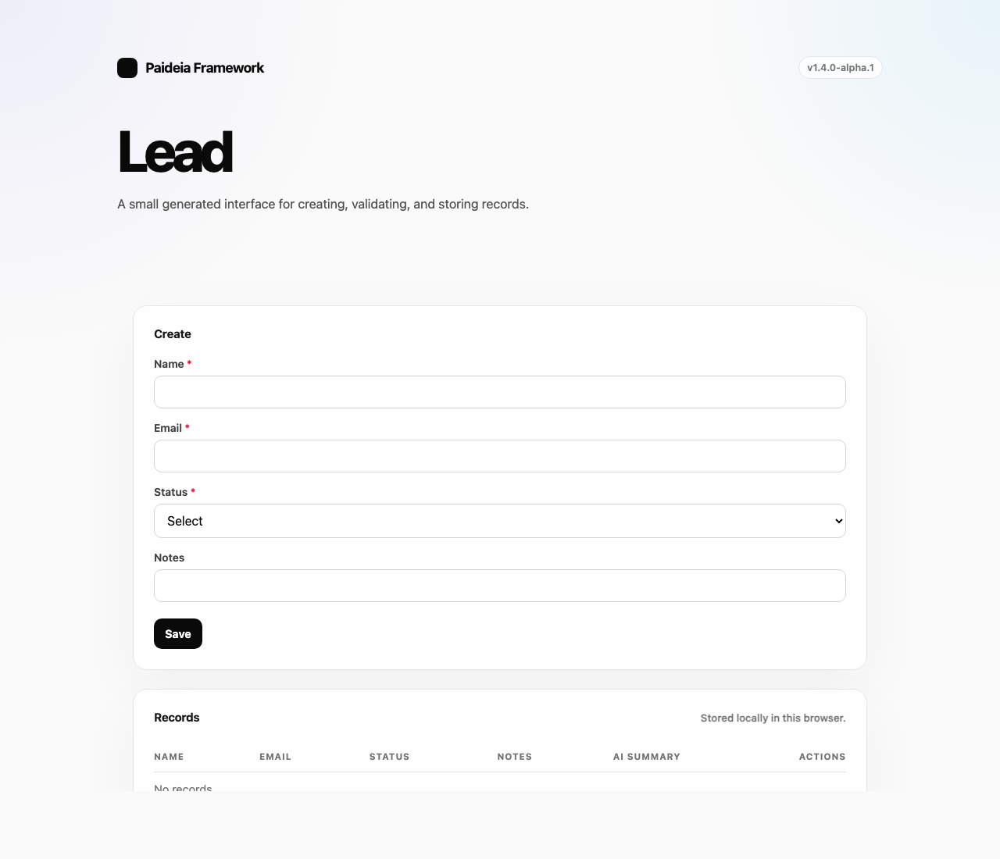
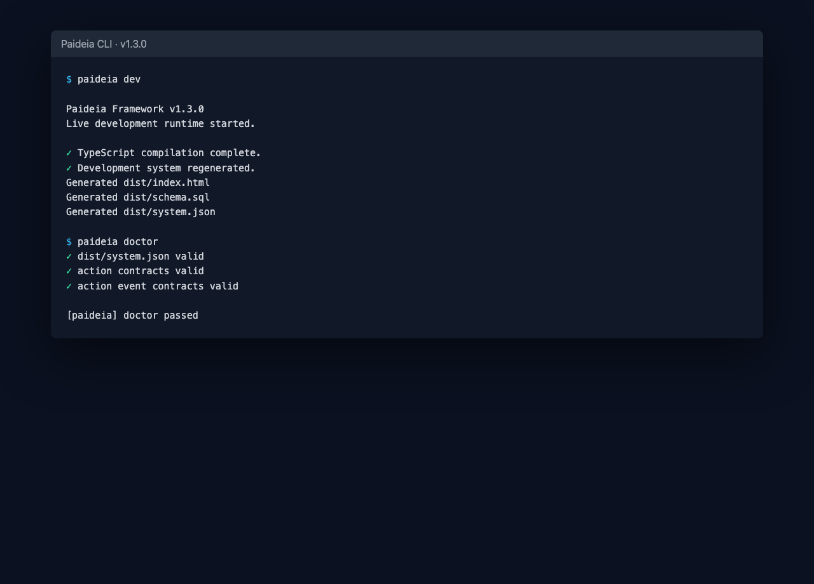
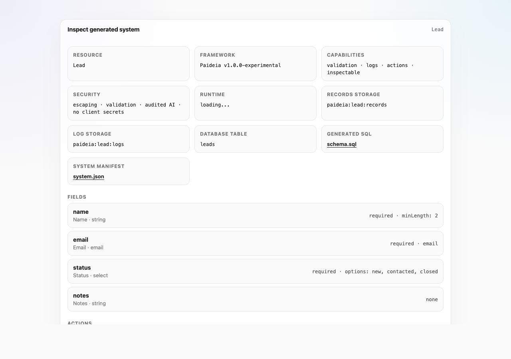
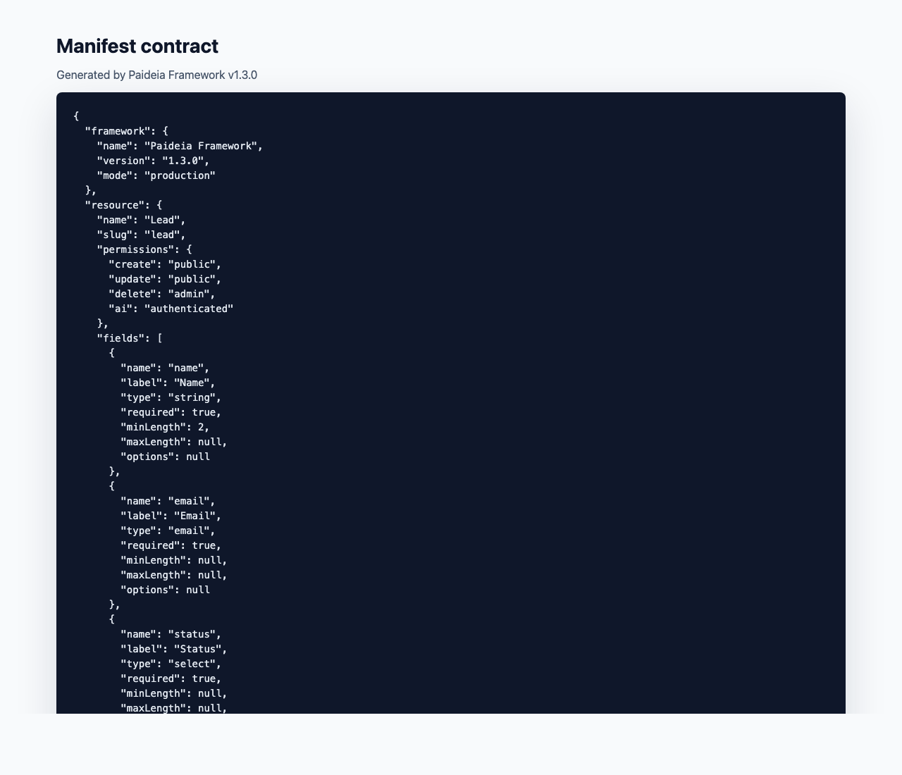
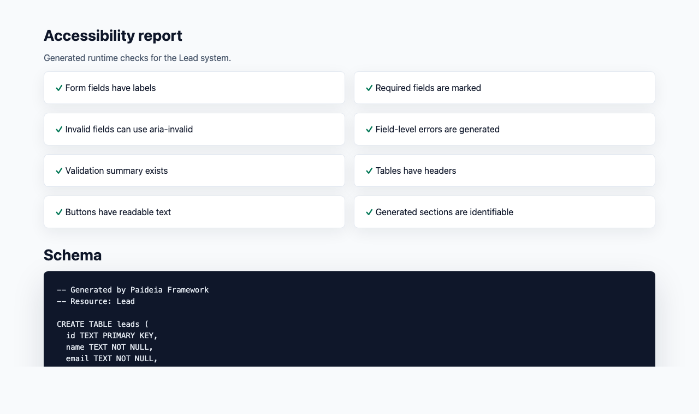

# Paideia Framework

Inspectable AI-native application runtime framework.

Describe the system. Generate the software. Keep it understandable.

Current version: v1.5.0-alpha.3
Writing collection runtime

Paideia starts from a resource declaration and generates a small, inspectable application foundation around it: UI, validation, local persistence, permissions, actions, AI capability contracts, SQL schema, runtime events, and a manifest that explains what was generated.

`v1.3.0` froze the first serious contract line:

```txt
Actions are explicit, inspectable, diagnosable runtime contracts.
```

That means actions are not just buttons in generated UI. They are declared in `dist/system.json`, rendered by `paideia explain`, validated by `paideia doctor`, and emitted as structured runtime events.

`v1.4.0` stabilizes the manifest-first runtime foundation: validated manifest in, stable runtime contract out.

## Screenshots

| Generated runtime | Development CLI |
| --- | --- |
|  |  |

| Development inspect panel | Manifest contract |
| --- | --- |
|  |  |

| Accessibility report |
| --- |
|  |

The CLI and inspect-panel screenshots show development tooling. Production exposes only the generated app and the safe `/__paideia/health` endpoint.

## What Paideia Is

Paideia is:

- a small operational runtime for generated applications
- a resource-driven generator for inspectable software foundations
- a manifest-centered trust model for humans and AI tools
- an experiment in making generated systems understandable instead of opaque

Paideia is not yet:

- a real authentication system
- a production database layer
- a production backend route runtime
- a hosted platform
- a real AI provider integration
- an external project scaffolder

## Current Limitations

Paideia is still early and intentionally small. `v1.3.0` is usable for generating, inspecting, diagnosing, and serving the included Lead demo, but it is not a full application platform yet.

Current runtime limitations include:

- browser-local persistence only
- simulated authentication roles
- simulated AI behavior
- manifested API routes, but no production backend route runtime yet
- no production database adapters yet
- no deployment adapters yet
- no `paideia new` project scaffolder yet

## Demo Story

The included demo is a lead intake system.

It shows how one resource declaration can produce a generated runtime that explains itself:

1. Create a lead.
2. Trigger validation when required fields are missing or invalid.
3. Mark the lead as contacted with a declared update action.
4. Try to summarize the lead as the public user.
5. Watch the AI action get blocked by permissions.
6. Inspect the event, manifest, schema, and runtime diagnostics to understand why.

The point is not that Paideia has a form. The point is that the generated system can explain its own shape, permissions, actions, and runtime behavior.

## What Paideia Generates

From the current Lead resource declaration, Paideia generates:

- `dist/index.html`: a browser runtime for creating, validating, storing, and acting on records
- `dist/schema.sql`: a SQL schema for the resource
- `dist/system.json`: a manifest describing the generated system contract

The generated browser runtime uses `localStorage` for persistence. Runtime dependencies are intentionally zero.

## Action Contracts

`v1.3.0` makes actions explicit in the generated manifest.

Example action contract:

```json
{
  "name": "summarize",
  "label": "Summarize",
  "type": "ai",
  "permission": "authenticated",
  "effect": {
    "kind": "ai.summarizeRecord"
  },
  "events": {
    "success": "ai.executed",
    "denied": "permission.denied"
  },
  "log": "AI summary generated for one Lead record."
}
```

Action contracts are:

- generated into `dist/system.json`
- rendered by `paideia explain`
- validated by `paideia doctor`
- connected to runtime event emission
- tied to explicit permission requirements

## Runtime Events

The generated browser runtime emits named events:

```txt
record.created
record.deleted
records.cleared
validation.failed
action.executed
ai.executed
permission.denied
```

Action event payloads include action metadata, resource metadata, permission context, effect details, and timestamps.

In development, browser events are visible in the generated framework log and bridged to the CLI:

```txt
[12:44:10 PM] Browser record.created
```

Production builds omit the browser-to-CLI bridge.

## Manifest Contract

`dist/system.json` is the contract of the generated system. It includes:

- framework name, version, and mode
- resource fields, actions, and permissions
- action effects and success/denied event contracts
- runtime target, persistence, composition, events, and developer tooling flags
- capabilities for storage, runtime, records, actions, and AI
- API route contracts
- AI guarantees and declared actions
- trust guarantees

This manifest is designed for humans, AI tools, editors, diagnostics, and future automation.

## CLI

The `v1.3.0` CLI lifecycle is:

```bash
paideia dev
paideia build
paideia manifest
paideia schema
paideia explain
paideia doctor
paideia start
paideia --version
paideia --help
```

Command behavior:

- `dev`: starts the development runtime on port `4317` by default
- `build`: generates production artifacts into `dist/`
- `manifest`: prints `dist/system.json`
- `schema`: prints `dist/schema.sql`
- `explain`: prints a Markdown summary of the generated system contract
- `doctor`: validates generated artifacts, action contracts, and action event contracts
- `start`: serves production artifacts on port `3000` by default

The package declares:

```json
{
  "bin": {
    "paideia": "./cli.mjs"
  }
}
```

The npm scripts delegate to the same CLI path:

```bash
npm run build
npm run doctor
npm run start
```

## Installed CLI Workflow

Paideia separates the installed package root from the directory where the command is run:

```txt
package root
  Paideia CLI, runtime, source, and build tooling

project root
  the current working directory where generated output is read or written
```

Supported from any directory after installing or linking the package:

```bash
paideia --version
paideia --help
paideia doctor
paideia manifest
paideia schema
paideia explain
paideia start
```

If generated output is missing, read-side commands fail cleanly and guide you to run `paideia build`.

External project generation is not supported yet. Outside the Paideia checkout, `paideia build` and `paideia dev` fail with explicit guidance instead of assuming the repository demo layout.

The installed CLI smoke check packs Paideia, installs it into a fresh temp project, and runs the installed binary:

```bash
npm run test:install-smoke
```

## Development Runtime

Start the live development runtime:

```bash
paideia dev
```

Default development port:

```txt
4317
```

Custom port:

```bash
PAIDEIA_PORT=4000 paideia dev
```

Development mode includes:

- file watching
- rebuilds
- local HTTP serving
- browser-to-CLI event bridge
- interactive CLI commands
- generated inspect panel
- generated framework log
- dev server runtime inspector API
- accessibility report

Interactive commands:

```txt
help
open
runtime
manifest
schema
events
a11y
clear
exit
```

Development-only HTTP routes:

```txt
GET /__paideia/runtime
GET /__paideia/manifest
GET /__paideia/schema
GET /__paideia/events
GET /__paideia/accessibility
```

These endpoints are development tooling. They are not part of production output.

## Production Runtime

Build production artifacts:

```bash
paideia build
```

Start the production runtime:

```bash
paideia start
```

Default production port:

```txt
3000
```

Custom port:

```bash
PAIDEIA_PORT=4000 paideia start
```

Production serves generated files from `dist/` and deliberately excludes development tooling such as the inspect panel, framework log, runtime inspector API, and browser-to-CLI bridge.

Production runtime behavior:

- deterministic artifact serving from `dist/`
- lifecycle logs for boot, ready, shutdown, and fatal errors
- graceful shutdown on `SIGINT` and `SIGTERM`
- `GET` and `HEAD` only
- hardened path containment for generated artifacts
- malformed URL handling
- explicit MIME types
- generic 404 responses
- method restrictions before health handling
- security headers:
  - `X-Content-Type-Options: nosniff`
  - `X-Frame-Options: DENY`
  - `Referrer-Policy: no-referrer`

### Health Endpoint

Production exposes one intentional operational endpoint:

```txt
GET /__paideia/health
```

Example response:

```json
{
  "status": "ok",
  "framework": "paideia",
  "version": "1.3.0",
  "runtime": "production",
  "dist": "ready"
}
```

This endpoint exposes only safe operational metadata. It does not expose filesystem paths, environment variables, stack traces, schema contents, generated app internals, or runtime adapters.

Other internal runtime routes, such as `/__paideia/runtime`, remain hidden in production.

## Diagnostics

Run diagnostics:

```bash
paideia doctor
```

`doctor` validates:

- `dist/` exists
- `dist/index.html` exists
- `dist/system.json` exists and is valid JSON
- `dist/schema.sql` exists, is non-empty, and includes `CREATE TABLE`
- generated action contracts
- generated action event contracts
- `.paideia/logs/runtime.log` is readable when present
- `.paideia/logs/crash.log` is readable when present

When diagnostics fail, doctor prints the likely next action. It also ends with a compact summary of passed, failed, and skipped checks.

## Runtime State

Paideia writes local runtime state under:

```txt
.paideia/
```

Current structure:

```txt
.paideia/
  logs/
    runtime.log
    crash.log
```

`runtime.log` is append-only operational history. It records lifecycle events, rejected methods, 404 requests, startup validation failures, and mirrored crash entries.

`crash.log` is append-only fatal incident history. It records uncaught exceptions and unhandled rejections.

`.paideia/` is local runtime state and should not be committed.

## Resource Model

Resources describe the shape and behavior of the system:

```ts
const leadResource = resource(
  "Lead",
  {
    name: string("Name").required().min(2),
    email: email("Email").required(),
    status: select(["new", "contacted", "closed"], "Status").required(),
    notes: string("Notes"),
  },
  {
    storage: "local",
    permissions: {
      create: "public",
      update: "public",
      delete: "admin",
      ai: "authenticated",
    },
    actions: [
      {
        name: "markContacted",
        label: "Mark contacted",
        type: "update",
        set: {
          status: "contacted",
        },
      },
      ai.summarizeRecord({
        name: "summarize",
        label: "Summarize",
      }),
    ],
  }
);
```

A resource can declare:

- fields and validation rules
- local storage behavior
- permission requirements
- update actions
- explicit AI actions
- runtime target

The reusable Lead example lives in `examples/lead-system/resource.ts`.

## Permissions

Paideia permissions are explicit and manifested:

```txt
public
authenticated
admin
```

The generated browser runtime enforces declared permissions for creation, update actions, deletion, and AI actions. The manifest records those requirements so the generated system can be inspected instead of guessed.

## Capabilities

Capabilities describe what the generated system can do:

- `storage.local`
- `runtime.browser`
- `record.read`
- `record.create`
- `record.update`
- `record.delete`
- `ai.summarizeRecord`

Capabilities are derived from the resource and actions, then written to `dist/system.json`.

## AI Philosophy

Paideia is AI-native, not AI-chaotic.

AI behavior must be:

- explicitly declared
- visible in the generated UI only when declared
- represented in the manifest
- auditable through logs and runtime events in development
- blocked by permissions when required

AI must not silently mutate state.

## Verification

The v1.3.0 release line was verified with:

```bash
node cli.mjs build
node cli.mjs doctor
node cli.mjs manifest
node cli.mjs schema
node cli.mjs explain
npm run test:install-smoke
PAIDEIA_PORT=4023 node cli.mjs start
curl http://localhost:4023/__paideia/health
```

Production hardening checks:

```txt
GET /__paideia/health -> 200
GET /__paideia/runtime -> 404
POST /__paideia/health -> 405
encoded path traversal attempts -> 404
```

## Dependency Policy

Current dependency shape:

```txt
runtime dependencies: 0
dev dependencies:
- typescript
- @types/node
```

This is intentional. Paideia favors simple infrastructure, small trusted surfaces, and inspectable generated output.

## Runtime Philosophy

Paideia's runtime should stay:

- small
- inspectable
- operationally explicit
- secure by default
- boring in production

The runtime favors native Node modules, explicit files, structured logs, and stable contracts over middleware stacks or hidden magic.

## Roadmap

The next architectural phase is not more action features, more CLI commands, or more UI generation.

The next phase is:

```txt
v1.4: manifest-first runtime foundation
```

The long-term direction:

```txt
resource declaration
-> manifest contract
-> runtime execution
```

Eventually:

```txt
Paideia language / AI contract generation
-> manifest contract
-> runtime execution
```

Future milestones:

- `v1.4`: manifest-first runtime foundation
- `v1.4.0-alpha.1`: manifest contract validation
- `v1.4.0-alpha.2`: path-aware manifest diagnostics
- `v1.4.0-beta.1`: normalized manifest runtime contract
- `v1.4.0`: manifest-first runtime foundation
- `v1.5`: Paideia-powered website runtime
- `v1.6`: AI provider adapters with audit logs
- `v2`: deeper runtime, compiler, and language direction

## Release History

- `v1.1`: production runtime, diagnostics, structured logs, health, and CLI surface
- `v1.2`: coherent CLI toolchain
- `v1.3.0`: actions are explicit, inspectable, diagnosable runtime contracts

## License

MIT
